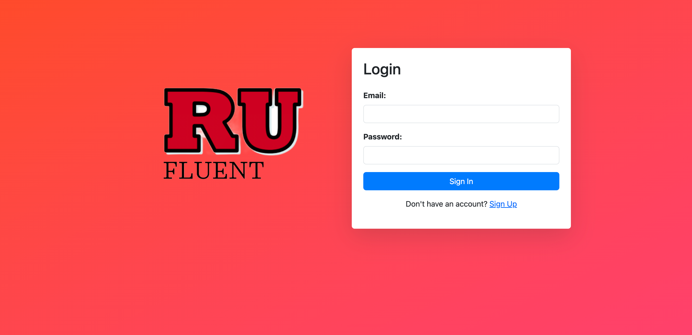
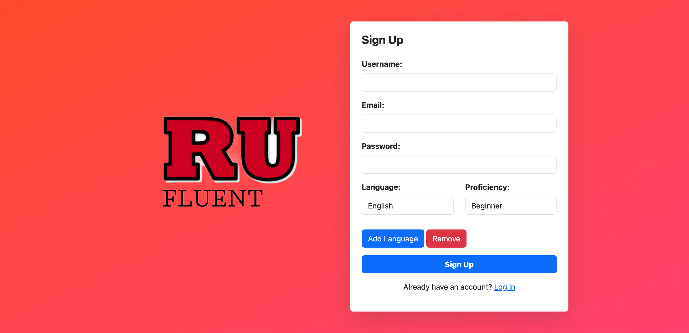
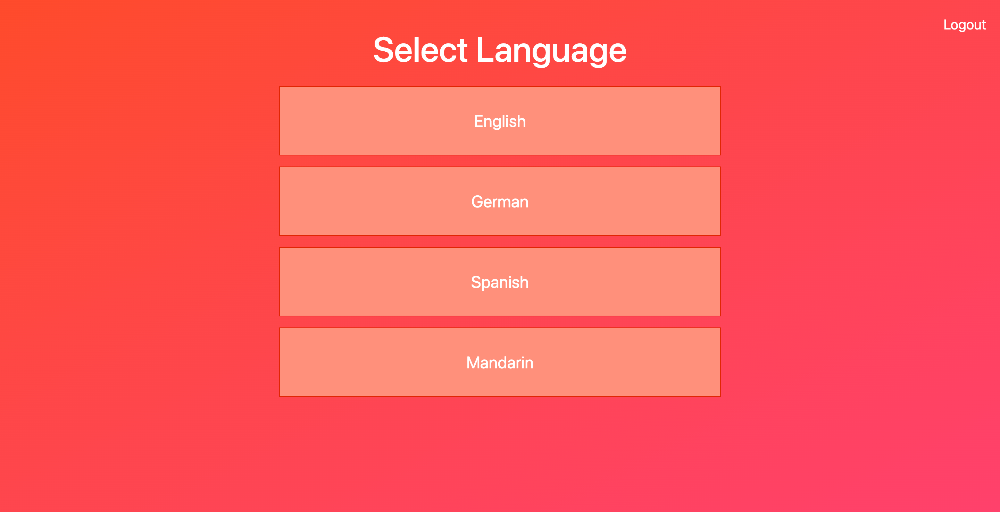
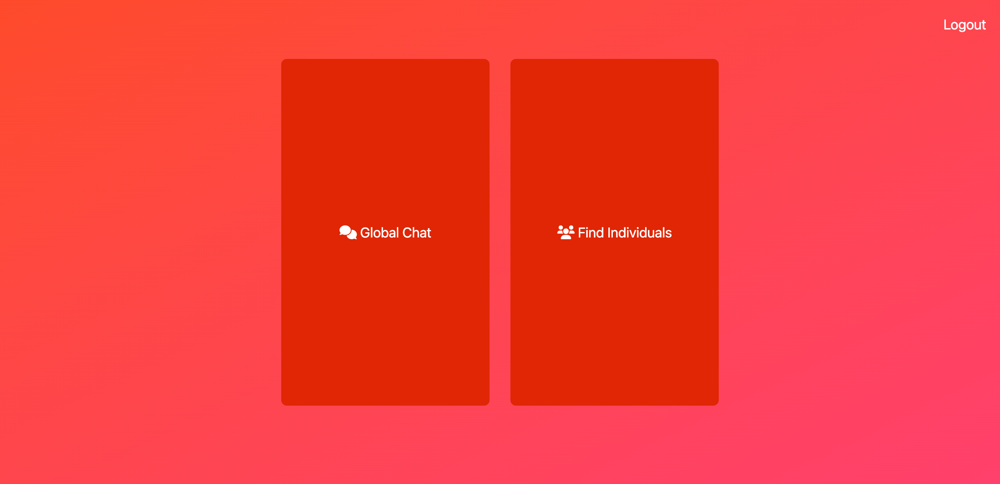
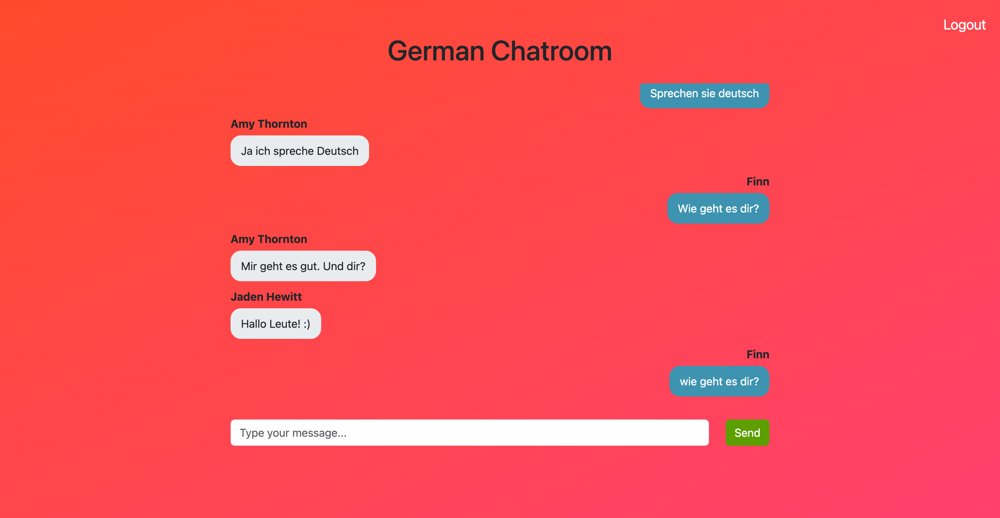

# HackRU Spring 2024 Submission #
Presenting **RUFluent**, a social platform designed to help international students at Rutgers connect with peers who speak their native language. By bridging language barriers, RUFluent fosters community, enhances cultural exchange, and creates a supportive environment for international students to find friends, study partners, and mentors who share a common linguistic background.
## How to Run ##
```python app.py```

## Demo Screenshots ##
### Login page ###


### Sign Up Page ###










